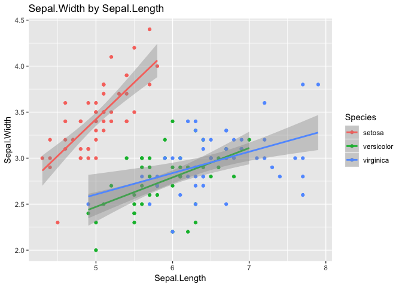
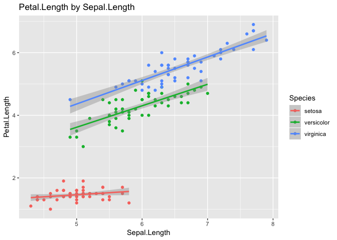
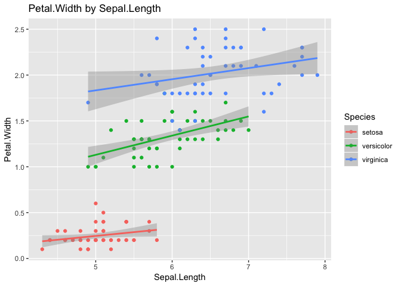
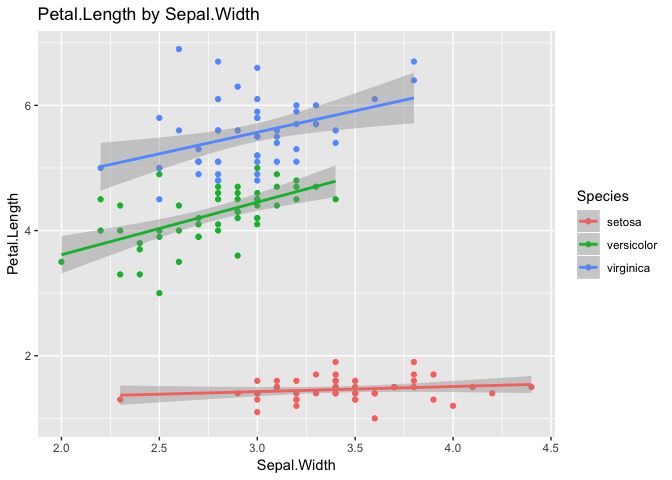
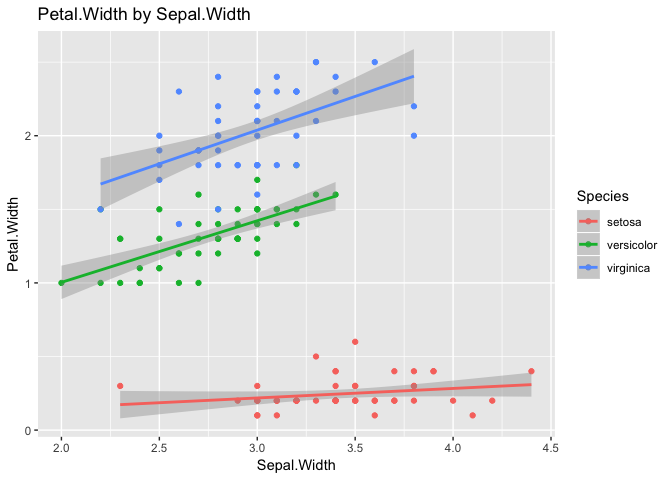
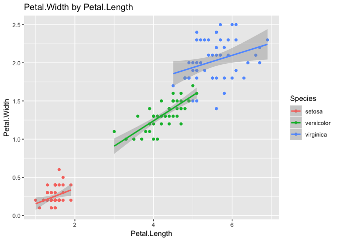

Iris dataset exploration, analysis and visualisation
================
Madlen Wilmes
2018-11-05

Purpose of the script
---------------------

Examplary analysis of the iconic iris data set. This script uses descriptive statistics, correlation analysis and visualization to explore a data set in R.

Load Data and explore
---------------------

``` r
data(iris)
attach(iris)
head(iris, 3)
```

    ##   Sepal.Length Sepal.Width Petal.Length Petal.Width Species
    ## 1          5.1         3.5          1.4         0.2  setosa
    ## 2          4.9         3.0          1.4         0.2  setosa
    ## 3          4.7         3.2          1.3         0.2  setosa

``` r
str(iris)
```

    ## 'data.frame':    150 obs. of  5 variables:
    ##  $ Sepal.Length: num  5.1 4.9 4.7 4.6 5 5.4 4.6 5 4.4 4.9 ...
    ##  $ Sepal.Width : num  3.5 3 3.2 3.1 3.6 3.9 3.4 3.4 2.9 3.1 ...
    ##  $ Petal.Length: num  1.4 1.4 1.3 1.5 1.4 1.7 1.4 1.5 1.4 1.5 ...
    ##  $ Petal.Width : num  0.2 0.2 0.2 0.2 0.2 0.4 0.3 0.2 0.2 0.1 ...
    ##  $ Species     : Factor w/ 3 levels "setosa","versicolor",..: 1 1 1 1 1 1 1 1 1 1 ...

``` r
summary(iris)
```

    ##   Sepal.Length    Sepal.Width     Petal.Length    Petal.Width   
    ##  Min.   :4.300   Min.   :2.000   Min.   :1.000   Min.   :0.100  
    ##  1st Qu.:5.100   1st Qu.:2.800   1st Qu.:1.600   1st Qu.:0.300  
    ##  Median :5.800   Median :3.000   Median :4.350   Median :1.300  
    ##  Mean   :5.843   Mean   :3.057   Mean   :3.758   Mean   :1.199  
    ##  3rd Qu.:6.400   3rd Qu.:3.300   3rd Qu.:5.100   3rd Qu.:1.800  
    ##  Max.   :7.900   Max.   :4.400   Max.   :6.900   Max.   :2.500  
    ##        Species  
    ##  setosa    :50  
    ##  versicolor:50  
    ##  virginica :50  
    ##                 
    ##                 
    ## 

The data is structured in 150 rows and 5 columns. Rows represent individual measurements of a flower in cm. The columns provide information on the sepal length, sepal width, petal length and petal width and species of each flower. There are 50 measurements for each of the three species, no missing data.

Explorative plots
-----------------

``` r
pairs(iris[,1:4])
```


``` r
ggplot(iris, aes(x = Sepal.Length, y = Petal.Length)) + geom_point() + aes(color = Species)
```


``` r
irislong <- iris %>% gather(Trait, Msmn, 1:4)
```

``` r
ggplot(irislong) + aes(x = Trait, y = Msmn, fill = Species) + geom_violin() +
  facet_grid(Species) + theme(axis.text.x = element_text(angle = 45, hjust=1))
```


``` r
sapply(iris[,1:4], var)
```

    ## Sepal.Length  Sepal.Width Petal.Length  Petal.Width 
    ##    0.6856935    0.1899794    3.1162779    0.5810063

``` r
sapply(iris[,1:4], mean)
```

    ## Sepal.Length  Sepal.Width Petal.Length  Petal.Width 
    ##     5.843333     3.057333     3.758000     1.199333

The means and variance of the different traits differs which might call for normalization before running k-means (despite identical measurement units).

Analysis and visualisation
--------------------------

``` r
## all combinations of traits (no repetition)
factorcombos <- combn(colnames(iris[,1:4]),2)
```

``` r
## anova and plots for each combination of traits
for(pos in 1:6){
  combo <- factorcombos[,pos]
  print(paste(combo[2], "by", combo[1], sep=" "))
  print(summary(aov(iris[,combo[1]] ~ iris[,combo[2]])))
  print(
    ggplot(iris, aes(x = iris[,combo[1]], y = iris[,combo[2]], color = Species)) + 
      geom_point() + 
      geom_smooth(method = "lm", se = T) +
      xlab(combo[1]) +
      ylab(combo[2]) +
      ggtitle(paste(combo[2], "by", combo[1], sep=" "))
  )
    }
```

    ## [1] "Sepal.Width by Sepal.Length"
    ##                   Df Sum Sq Mean Sq F value Pr(>F)
    ## iris[, combo[2]]   1   1.41  1.4122   2.074  0.152
    ## Residuals        148 100.76  0.6808



    ## [1] "Petal.Length by Sepal.Length"
    ##                   Df Sum Sq Mean Sq F value Pr(>F)    
    ## iris[, combo[2]]   1  77.64   77.64   468.6 <2e-16 ***
    ## Residuals        148  24.53    0.17                   
    ## ---
    ## Signif. codes:  0 '***' 0.001 '**' 0.01 '*' 0.05 '.' 0.1 ' ' 1



    ## [1] "Petal.Width by Sepal.Length"
    ##                   Df Sum Sq Mean Sq F value Pr(>F)    
    ## iris[, combo[2]]   1  68.35   68.35   299.2 <2e-16 ***
    ## Residuals        148  33.81    0.23                   
    ## ---
    ## Signif. codes:  0 '***' 0.001 '**' 0.01 '*' 0.05 '.' 0.1 ' ' 1



    ## [1] "Petal.Length by Sepal.Width"
    ##                   Df Sum Sq Mean Sq F value   Pr(>F)    
    ## iris[, combo[2]]   1  5.196   5.196   33.27 4.51e-08 ***
    ## Residuals        148 23.111   0.156                     
    ## ---
    ## Signif. codes:  0 '***' 0.001 '**' 0.01 '*' 0.05 '.' 0.1 ' ' 1



    ## [1] "Petal.Width by Sepal.Width"
    ##                   Df Sum Sq Mean Sq F value   Pr(>F)    
    ## iris[, combo[2]]   1  3.794   3.794   22.91 4.07e-06 ***
    ## Residuals        148 24.512   0.166                     
    ## ---
    ## Signif. codes:  0 '***' 0.001 '**' 0.01 '*' 0.05 '.' 0.1 ' ' 1



    ## [1] "Petal.Width by Petal.Length"
    ##                   Df Sum Sq Mean Sq F value Pr(>F)    
    ## iris[, combo[2]]   1  430.5   430.5    1882 <2e-16 ***
    ## Residuals        148   33.8     0.2                   
    ## ---
    ## Signif. codes:  0 '***' 0.001 '**' 0.01 '*' 0.05 '.' 0.1 ' ' 1



Strong association of Petal.Length ~ Petal.Width (highest F-value)

``` r
select(iris, -Species) %>% cor()
```

    ##              Sepal.Length Sepal.Width Petal.Length Petal.Width
    ## Sepal.Length    1.0000000  -0.1175698    0.8717538   0.8179411
    ## Sepal.Width    -0.1175698   1.0000000   -0.4284401  -0.3661259
    ## Petal.Length    0.8717538  -0.4284401    1.0000000   0.9628654
    ## Petal.Width     0.8179411  -0.3661259    0.9628654   1.0000000

Numerical confirmation that Petal.Length ~ Petal.Width are highly (positively) correlated.

``` r
## use clustering to visualize correlation of variables; 
## the closer, the stronger correlated
## blue for positive correlation, red for negative
select(iris, -Species) %>% correlate() %>% network_plot()
```

    ## 
    ## Correlation method: 'pearson'
    ## Missing treated using: 'pairwise.complete.obs'


``` r
chart.Correlation(iris[,1:4], histogram=TRUE, pch=19)
```


Remaining question
------------------

What descriptive statistics should be used to determine the best combination of traits for k-means clustering? High F-value in ANOVA (as that points to good separation of factors? Should all traits be used with weights? How should they be weighed?

Note that correlated traits can bias the clustering process. Basically 'doubling down' on the same signal and giving it more weight in the clustering process than warranted.
