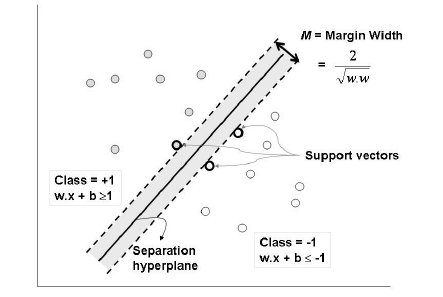

```{r setup, include=FALSE}
knitr::opts_chunk$set(echo = TRUE)
library(e1071)
library(ggplot2)
```

## Purpose of the script

Use iris data set to explore clustering via support vector machines (SVM) to classify species (supervised machine learning). 

## A bit of theory

- useful for labeled data with unknown distribution
- linear SVM is rarely used as real world data is usually more messy
- linear SVM comprable to linear regression, non-linear SVM comparable to logistic regression
- using kernel -> transformation (function) that allows better separation of points in space (compared to linear separator... example: distort a map to reflect travel time instead of linear distance)
- for linear, binary data, one chooses a classifier line (y = ax + b) -> make it equidistant from data points closest to the line of either side (these are called support vectors) -> maximize the margin (m), so data in the test case can be classified even if farther away from training test cluster
- margin is twice the distance to the separator line from the support vector


Caution:
- SVM is prone to overfitting




## Load Data

```{r load_data}
data(iris)
attach(iris)
```


## Prep data set
```{r}
## split ramdomly into training and test sets
iris[,"train"] <- ifelse(runif(nrow(iris)) < 0.8, 1, 0)
## separate training and test sets by using the flag culumn "train"
trainset <- iris[iris$train == 1,]
testset <- iris[iris$train == 0,]
## remove training flag column
trainset <- subset(trainset, select = -c(train))
testset <- subset(testset, select = -c(train))
```


```{r run SVM}
## build model – linear kernel and C-classification (soft margin) with default cost (C = 1)
## predict Species, using all data points (signified by the dot)
## if kernel is set to radial, it uses radial basis function (RBF)
svm_model <- svm(Species ~ ., data = trainset, kernel ="radial")
summary(svm_model)
```

## plot results of training model
```{r plot training model for two traits, keep other two constant}
plot(svm_model, data = trainset, Petal.Width ~ Petal.Length, slice = list(Sepal.Width = 3, Sepal.Length = 4))
```

```{r training set predictions}
pred_train <- predict(svm_model, trainset)
## test set predictions
pred_test <- predict(svm_model, testset)
```

## Confusion matrix and Misclassification error

```{r compare prediction to real labels}
accu_tab <- table(Predicted = pred_test, Real = testset$Species)
accu_tab
## misclassification rate
1 - sum(diag(accu_tab)) / sum(accu_tab)
## classification accuracy
sum(diag(accu_tab)) / sum(accu_tab)
```

Misclasification rate = 1 /30 = 0.033
Classification accuracy = 29 / 30 = 0.967

## Model Tuning (hyperparameter optimization)

The rate at which a kernel decays is governed by the parameter $\gamma$ – the higher the value of $\gamma$, the more rapid the decay. This serves to illustrate that the RBF kernel is extremely flexible….but the flexibility comes at a price – the danger of overfitting for large values of $\gamma$.  One should choose appropriate values of cost (C) and $\gamma$ so as to ensure that the resulting kernel represents the best possible balance between flexibility and accuracy.
To reiterate a point made earlier, this means that a solution that has fewer support vectors is likely to be more robust than one with many. Why? Because the data points defining support vectors are ones that are most sensitive to noise- therefore the fewer, the better.

```{r tune svm model}
set.seed(42)
## don't run more combinations than your machine can handle (with large data sets)
tune_model <- tune(svm, Species~.,
                   data = trainset, 
                   ranges = list(epsilon = seq(0,1,0.1), cost = 2^(2:7))
                   )
## darker regions mean better results
plot(tune_model)
summary(tune_model)
```

## retrieve model with 'best' parameters
```{r new prediction with optimized model parameters}
## grab the optimized model
opti_model <- tune_model$best.model
summary(opti_model)
plot(opti_model, data = trainset, Petal.Width ~ Petal.Length, slice = list(Sepal.Width = 3, Sepal.Length = 4))
```

### re-run on training set
```{r re-run on training set}
pred_train <- predict(opti_model, trainset)
accu_tab <- table(Predicted = pred_train, Real = trainset$Species)
accu_tab
## misclassification rate
1 - sum(diag(accu_tab)) / sum(accu_tab)
## classification accuracy
sum(diag(accu_tab)) / sum(accu_tab)
```

### re-run on test set
```{r re-run on test set}
pred_test <- predict(opti_model, testset)
accu_tab <- table(Predicted = pred_test, Real = testset$Species)
accu_tab
## misclassification rate
1 - sum(diag(accu_tab)) / sum(accu_tab)
## classification accuracy
sum(diag(accu_tab)) / sum(accu_tab)
```

## Resources
https://eight2late.wordpress.com/2017/02/07/a-gentle-introduction-to-support-vector-machines-using-r/